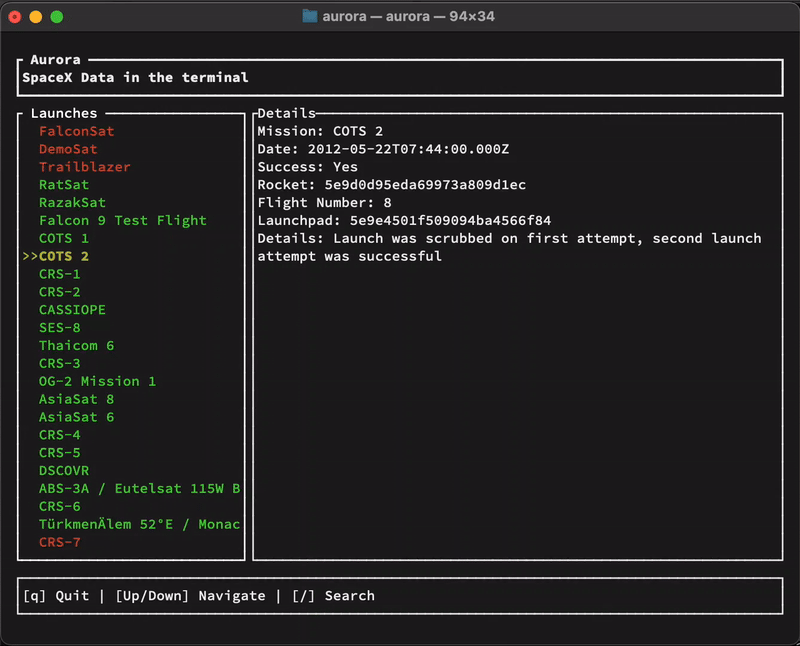

# Aurora

SpaceX data in the comfort of your Terminal.



## Usage

Clone the repository then run the following command

```sh
cargo run
```
    
## Build

Build and distribute this by running the following command
```sh
cargo build --release
```

## License

Copyright (c) Dan Barcinas <barcinasdan@gmail.com>

This project is licensed under the MIT license ([LICENSE] or <http://opensource.org/licenses/MIT>)

[LICENSE]: ./LICENSE
